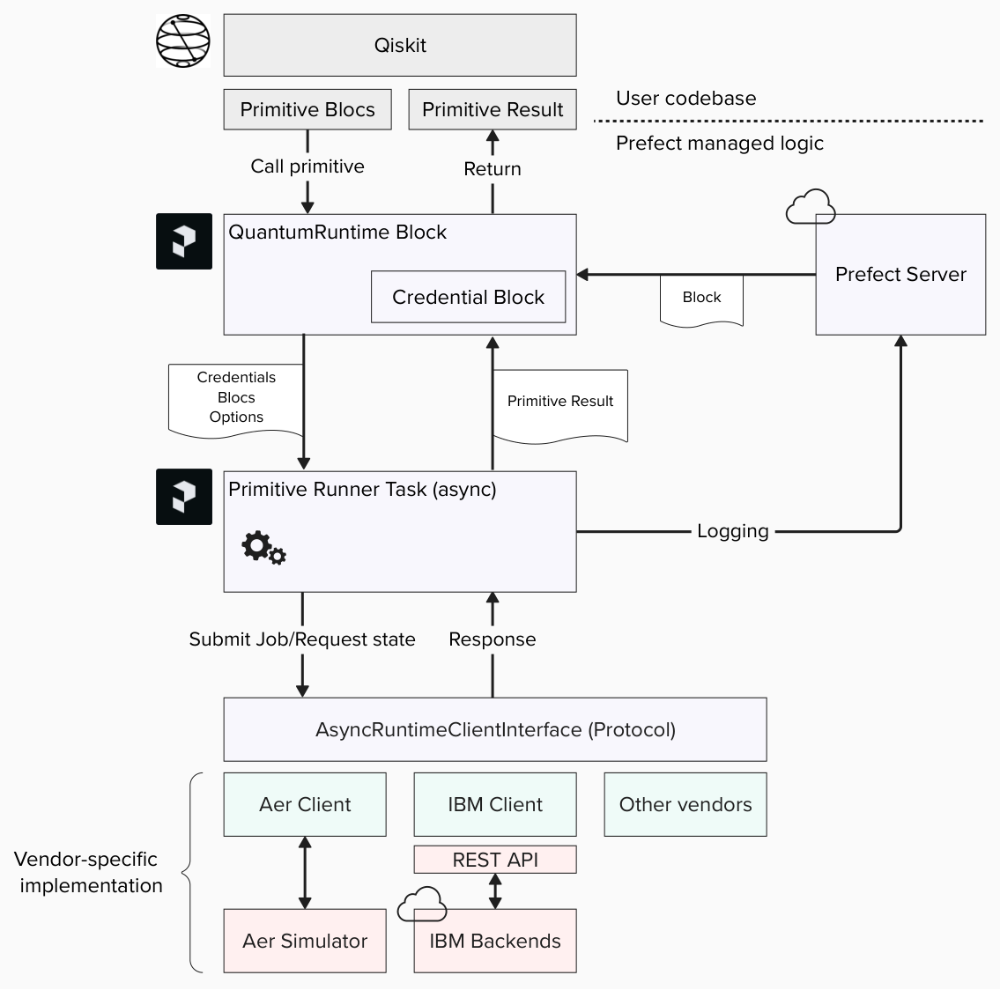

# Prefect Qiskit

The `prefect-qiskit` integration makes it easy to write quantum computing workflow.
You can use the Prefect version of Qiskit Primitives, which leverage the capabilities of workflow management software for robust execution.

See [Tutorials](./tutorials/01_getting_started.md) for full example.

## Qiskit Primitives

Quantum Primitives are abstractions of quantum computation. 
This model takes a Primitive Unified Bloc (PUB) as input and returns results depending on the input PUB type. 
Typically, quantum programs are represented by the Quantum Circuit model. 

For example, the Qiskit implementation of this model may look like this:

```python
from qiskit import QuantumCircuit
from qiskit.primitives import BackendSamplerV2
from qiskit.providers.fake_provider import GenericBackendV2

# Define backend
backend = GenericBackendV2(2)

# Create quantum circuit
circ = QuantumCircuit(2)
circ.h(0)
circ.cx(0, 1)
circ.measure_all()

# Define Primitive
primitive = BackendSamplerV2(backend=backend)
pub = (circuit, )

# Execute
job = primitive.run([pub])
result = job.result()
```

## Quantum Computation

As quantum computing technology advances, large-scale experiments are becoming more common. These experiments often involve repeated job execution on quantum processors, with readout data being processed remotely at scale.

Quantum computers, compared to conventional ones, still experience higher operation errors and occasional failures due to their complex control systems.

Given the high cost of quantum computation, it's prudent to implement robust execution practices at the application level, particularly for large experiments.

## Prefect

To add robustness and scalability to your quantum computing workflow, integrating a cloud-native workflow orchestrator, such as Prefect, is a good option. 

With Prefect, you can easily turn your existing codebase into a workflow.
For example, a common programming pattern in quantum workflow, called [Qiskit Pattern](https://docs.quantum.ibm.com/guides/intro-to-patterns), may look as below with the Prefect syntax.

```python
from prefect import task, flow
...

@task
def mapping_problem(**params):
    ...

@task
def optimize(circuit, target):
    ...

@task
def post_processing(result):
    ...

@flow
def experiment(**params):
    ...

    # Qiskit Pattern: Mapping
    circuit = mapping_problem(**params)

    # Qiskit Pattern: Optimize
    isa = optimize(circuit, target)

    # Qiskit Pattern: Execute
    result = runtime.sampler([isa])

    # Qiskit Pattern: Post-Processing
    data = post_processing(result)
```


Prefect offers a framework for [third-party integration](https://docs.prefect.io/integrations/integrations), 
which include, for example, [AWS](https://docs.prefect.io/integrations/prefect-aws), [Azure](https://docs.prefect.io/integrations/prefect-azure), and [GCP](https://docs.prefect.io/integrations/prefect-gcp).
Using Prefect for workflow orchestration offers several advantages:

* Ease of Integration:
  Prefect integrates seamlessly with various third-party services, making it easy to incorporate into existing workflows.

* Scalability:
  Prefect can handle workflows of any size, from small experiments to large-scale computations.

* Robust Error Handling:
  Prefect's checkpoint and retry mechanisms ensure that workflows can recover from failures and continue execution.

## Prefect Qiskit Integration

This plugin provides integration for quantum computation through the Primitive model with Qiskit implementation. 
With this plugin, the Primitive execution in the example code may be simplified as below:

```python
result = runtime.sampler([pub])
```

Since our runtime is an asynchronous implementation, you can efficiently sample multiple PUBs in parallel:

```python
import asyncio

results = await asyncio.gather(*[runtime.sampler([pub]) for pub in pubs])
```

See [Asyncio task guide](https://docs.python.org/3/library/asyncio-task.html) for Python syntax.

As you may notice, the job object is encapsulated and the runtime directly returns the result. 
Primitive execution is now implemented as a Prefect workflow to provide a checkpoint mechanism and repeat-until-success to mitigate execution failures. 

You can also pre- and post-process data with other third-party cloud integrations.

### Software Architecture

This diagram shows the software design of this plugin.

{: style="width:750px"}

Users can use Qiskit to prepare PUBs. 
If they already have a codebase written in Qiskit, they can easily turn the experiment into a Prefect workflow. 

The [`QuantumRuntime`](./reference.md#prefect_qiskit.runtime.QuantumRuntime) Block contains a vendor-specific credential Block, 
and it spawns a client that implements the [`AsyncRuntimeClientInterface`](./reference.md#prefect_qiskit.models.AsyncRuntimeClientInterface) protocol against vendor-specific API. 

The [`run_primitive`](./reference.md#prefect_qiskit.primitives.run_primitive) function (Primitive Runner Task), manages the execution on this abstraction layer. 
Thanks to this abstraction, we can use a common Prefect workflow on different vendor APIs. 

When the runtime Block invokes a primitive, it calls the Prefect task with the credentials Block, PUBs, and vendor specific options.
This task implements the checkpoint and repeat-until-success mechanism.

### Supported Vendors

We support following quantum computing vendors.

#### Qiskit Aer

[Qiskit Aer](https://github.com/Qiskit/qiskit-aer) is a high performance simulator for quantum circuits.

```python
from prefect_qiskit.vendors.qiskit_aer import QiskitAerCredentials

credential = QiskitAerCredentials()
```

#### IBM Quantum

[IBM Quantum](https://quantum.cloud.ibm.com/) provides quantum processors with superconducting qubit architecture.

```python
from prefect_qiskit.vendors.ibm_quantum import IBMQuantumCredentials

credential = IBMQuantumCredentials(api_key="...", crn="crn:...")
```

## Resources

For assistance using Qiskit, consult the [Qiskit Documentation](https://docs.quantum.ibm.com/) and, in particular, the [Primitive Documentation](https://docs.quantum.ibm.com/guides/primitives).

See the API specification of each quantum computer vendor for the data schema of primitive options.
For IBM Quantum, checkout the [REST API specification](https://docs.quantum.ibm.com/api/runtime/tags/jobs#tags__jobs__operations__CreateJobController_createJob). 
